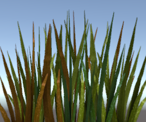

# ShaderLab: Blending

[TOC]

Blending是用来实现透明物体的。


当图像被渲染，在所有shader运行后和所有纹理提供后，像素会被写到屏幕上。它们如何与已经存在的内容结合在一起，是由混合命令控制的。

## Syntax

`Blend Off`: 关闭blending (this is the default)

`Blend SrcFactor DstFactor`: 启动 blending. 

​	FinalColor = 生成的颜色 * **SrcFactor**   +   屏幕上已经存在的颜色乘 * **DstFactor**

​	比如：Blend One One，FinalColor = 计算的结果 * 1 + 目标结果 * 1

`Blend SrcFactor DstFactor, SrcFactorAlpha DstFactorAlpha`: 同上，但使用不同的因子来混合alpha通道.

​	比如: Blend SrcColor DstAlpha, SrcAlpha DstAlpha

​	FinalColor.r = shaderOutColor.r * SrcColor.r + frameBufferColor.r * DstAlpha

​	FinalColor.g = shaderOutColor.g * SrcColor.g + frameBufferColor.g * DstAlpha

​	FinalColor.b = shaderOutColor.b * SrcColor.b + frameBufferColor.b * DstAlpha

​	FinalColor.a = shaderOutColor.a * SrcAlpha + frameBufferColor.a * DstAlpha

​	

`BlendOp Op`: 不要将混合色相加，对它们进行不同的操作。默认为 Add

`BlendOp OpColor, OpAlpha`: 同上，但使用不同的混合操作来混合颜色（RGB）和alpha（A）通道。

此外你可以设置upper-rendertarget blending modes. 当使用多目标渲染时(MRT), 上面的语法设置了相同的混合模式给所有目标. 下面的语法可以设置不同的混合模式给不同的渲染目标．

`N`所在位置是渲染目标的索引(0..7)。这个特征在大多现代APIs/GPUs上有效(DX11/12, GLCore, Metal, PS4):

- `Blend N SrcFactor DstFactor`
- `Blend N SrcFactor DstFactor, SrcFactorA DstFactorA`
- `BlendOp N Op`
- `BlendOp N OpColor, OpAlpha`

`AlphaToMask On`:打开 alpha-to-coverage. 当 MSAA 被使用时, alpha-to-coverage多重采样范围遮罩按比例修改像素Shader的alpha值. 这通常用于得到比常规alpha test少的轮廓走样; 对于植被等其他alpha-tested Shaders有效。

## Blend operations

以下blend操作可用:

| 操作                    | 描述                                             |
| ----------------------- | ------------------------------------------------ |
| **Add**                 | 添加源和目标                                     |
| **Sub**                 | 从源减去目标                                     |
| **RevSub**              | 从目标减去源                                     |
| **Min**                 | 使用目标和源种较小的                             |
| **Max**                 | 使用目标和源种较大的                             |
| **LogicalClear**        | 逻辑操作: Clear (0) **DX11.1 only**              |
| **LogicalSet**          | 逻辑操作: Set (1) **DX11.1 only**                |
| **LogicalCopy**         | 逻辑操作: Copy (s) **DX11.1 only**               |
| **LogicalCopyInverted** | 逻辑操作: Copy inverted (!s) **DX11.1 only**.    |
| **LogicalNoop**         | 逻辑操作: Noop (d) **DX11.1 only**               |
| **LogicalInvert**       | 逻辑操作: Invert (!d) **DX11.1 only**            |
| **LogicalAnd**          | 逻辑操作: And (s & d) **DX11.1 only**            |
| **LogicalNand**         | 逻辑操作: Nand !(s & d) **DX11.1 only**.         |
| **LogicalOr**           | 逻辑操作: Or (s                                  |
| **LogicalNor**          | 逻辑操作: Nor !(s                                |
| **LogicalXor**          | 逻辑操作: Xor (s ^ d) **DX11.1 only**.           |
| **LogicalEquiv**        | 逻辑操作: Equivalence !(s ^ d) **DX11.1 only**.  |
| **LogicalAndReverse**   | 逻辑操作: Reverse And (s & !d) **DX11.1 only**.  |
| **LogicalAndInverted**  | 逻辑操作: Inverted And (!s & d) **DX11.1 only**. |
| **LogicalOrReverse**    | 逻辑操作: Reverse Or (s \| !d) **DX11.1 only**   |
| **LogicalOrInverted**   | 逻辑操作: Inverted Or (!s \| d) **DX11.1 only**  |

## Blend factors

以下的所有属性对于在**Blend** command的SrcFactor & DstFactor都有效。 **Source** 是指计算的颜色, **Destination** 是已经在屏幕上的颜色. 如果**BlendOp**被使用作为逻辑操作，混合系数会被忽略。

| factors              | description                               |
| -------------------- | ----------------------------------------- |
| **One**              | 1 - 使用此项可以使源或目标颜色完全通过    |
| **Zero**             | 0 - 使用此方法可删除源或目标值            |
| **SrcColor**         | 此阶段的值乘以 源颜色值                   |
| **SrcAlpha**         | 此阶段的值乘以 源alpha值                  |
| **DstColor**         | 此阶段的值乘以 帧缓冲区源色值             |
| **DstAlpha**         | 此阶段的值乘以 帧缓冲区源alpha值          |
| **OneMinusSrcColor** | 此阶段的值乘以 (1 - source 颜色值)        |
| **OneMinusSrcAlpha** | 此阶段的值乘以 (1 - source alpha值)       |
| **OneMinusDstColor** | 此阶段的值乘以 (1 - destination 颜色值).  |
| **OneMinusDstAlpha** | 此阶段的值乘以 (1 - destination alpha值). |

## Details

以下是最常见的混合类型:

```C++
Blend SrcAlpha OneMinusSrcAlpha // Traditional transparency
Blend One OneMinusSrcAlpha // Premultiplied transparency
Blend One One // Additive
Blend OneMinusDstColor One // Soft Additive
Blend DstColor Zero // Multiplicative
Blend DstColor SrcColor // 2x Multiplicative123456
```

## Alpha blending, alpha testing, alpha-to-coverage

主要用于绘制完全不透明或完全透明的物体, 透明度是由纹理的alpha通道定义的 (比如：树叶、草、围栏链等等), 常用的几种方法如下:

### Alpha blending


> 常规alpha混合

这通常意味着对象必须被视为“半透明”，因此不能使用一些渲染特性 (例如: 延迟阴影，不能接收阴影)。 凹形或重叠alpha-blended对象，经常也有绘制顺序问题。

通常, alpha-blended Shaders 也设置 transparent [render queue](https://docs.unity3d.com/Manual/SL-SubShaderTags.html), 并关闭深度写入(depth writes)。所以shader代码看起来像这样：

```C++
// inside SubShader
Tags { "Queue"="Transparent" "RenderType"="Transparent" "IgnoreProjector"="True" }

// inside Pass
ZWrite Off
Blend SrcAlpha OneMinusSrcAlpha
```

### Alpha testing/cutout(裁剪)


> 在像素shader中使用clip()

通过在像素Shader中使用 `clip()` HLSL 指令, 一个像素可以被“丢弃”或不基于某些标准。这意味着对象仍然可以被视为完全不透明的, 并且没有绘制顺序的问题. 然而, 这意味着所有的像素都是不透明或全透明的，从而导致走样(jaggies)。

通常，经过alpha测试过的shader也会设置裁剪渲染队列，所以shader看起来像这样：

```c++
// inside SubShader
Tags { "Queue"="AlphaTest" "RenderType"="TransparentCutout" "IgnoreProjector"="True" }

// inside CGPROGRAM in the fragment Shader:
clip(textureColor.a - alphaCutoffValue);
```

### Alpha-to-coverage



> AlphaToMask开启，4倍MSAA

当使用多重采样抗失真（MSAA，请看QualitySettings一文，链接见原网页），可以通过使用alpha-to-coverage GPU功能来改进alpha测试方法。可以根据MSAA所使用的级别，来改善边缘显示。

此功能最适用于大多数不透明或透明的纹理，并且具有非常薄的“部分透明”区域（草，树叶和类似物）。

通常，alpha-to-coverage shader还会设置剪切渲染队列。所以Shader代码看起来像：

```c++
// inside SubShader
Tags { "Queue"="AlphaTest" "RenderType"="TransparentCutout" "IgnoreProjector"="True" }

// inside Pass
AlphaToMask On
```

## Example

这是一个小的例子Shader用来添加纹理到任何已经存在屏幕上的东西:

```C++
Shader "Simple Additive" {
    Properties {
        _MainTex ("Texture to blend", 2D) = "black" {}
    }
    SubShader {
        Tags { "Queue" = "Transparent" }
        Pass {
            Blend One One
            SetTexture [_MainTex] { combine texture }
        }
    }
}
```