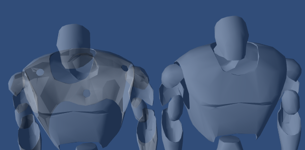

# ShaderLab: Culling & Depth Testing

[TOC]


Culling 是一种优化，不会渲染背向观察者的多边形。所有多边形都有正反两面。Culling利用了大多数对象都是封闭的这一事实。如果你有一个立方体，那么你永远也看不到，不面向你的那一边(总会有一个面向你的一边挡住它)。所以我们不需要绘制背向我们的那边。Hence the term: Backface culling（因此叫做：背面剔除）。

另一个让渲染看起来正确的特效是深度测试。深度测试确保只有最近的面和对象会被绘制在场景中。

## Syntax

### Cull

```
Cull Back | Front | Off
```

控制哪个方向的多边形应该被剔除(culling)(不会绘制)

- **Back** 不渲染背向观察者的多边形(*default*)。
- **Front** 不绘制面向观察者的多边形。用于暴露对象的内部结构。
- **Off** Disables culling（不剔除） - 所有的面都会被绘制。用于特殊效果。

### ZWrite

```C#
ZWrite On | Off
```

控制是否将来自该对象的像素写入depth buffer (default is *On*)。如果你在绘制固体(Solid Objects)，请设置 *On*。如果你在绘制半透明效果，请切换到 *ZWrite Off*。 请继续阅读获取更多细节。

### ZTest

```C#
ZTest Less | Greater | LEqual | GEqual | Equal | NotEqual | Always　|　Off
```

设置深度测试如何进行. 默认为 *LEqual* (绘制在距离内存在的对象; 隐藏其后的对象).

### Offset

```C#
Offset Factor, Units
```

允许您通过两个参数*factor* 和 *units*指定深度偏移。*Factor* 缩放Z在多边形中相对于 X 或 Y 的最大斜率, and *units* 缩放最小可分辨的深度缓冲值。这允许你强制一个多边形被画在另一个多边形上，尽管它们实际上处于同一位置。例如 *Offset 0, –1* 将多边形更拉近相机忽略多边形的斜率, 而 *Offset –1, –1* 将把对象拉的更近(当做以掠射角查看时)

## Examples

这个对象将渲染其背面:

```C#
Shader "Show Insides" {
    SubShader {
        Pass {
            Material {
                Diffuse (1,1,1,1)
            }
            Lighting On
            Cull Front
        }
    }
}
```

尝试将它添加到立方体, 并注意当你围绕观察的时候几何体是如何让你感觉错误的。这是因为你只能看见立方体的内部。

### Transparent shader with depth writes

通常 [semitransparent shaders](https://docs.unity3d.com/Manual/shader-TransparentFamily.html) 不写入深度缓冲。 然而, 这样会导致绘制顺序问题，尤其是绘制复杂的非凸（non-convex）mesh时。如果你希望淡入淡出这样的mesh，那么用一个shader在显示透明度之前，填充深度缓冲区可能有用。



> 半透明对象;
>
> 左边: standard Transparent/Diffuse shader; 
>
> 右边: shader that writes to depth buffer(shader写入了深度缓冲).

```C#
Shader "Transparent/Diffuse ZWrite" {
    Properties {
        _Color ("Main Color", Color) = (1,1,1,1)
        _MainTex ("Base (RGB) Trans (A)", 2D) = "white" {}
    }
    SubShader {
        Tags {
            "Queue"="Transparent"
            "IgnoreProjector"="True"
            "RenderType"="Transparent"
        }
        LOD 200

        // extra pass that renders to depth buffer only
        Pass {
            ZWrite On
            ColorMask 0
        }

        // paste in forward rendering passes from Transparent/Diffuse
        UsePass "Transparent/Diffuse/FORWARD"
    }
    Fallback "Transparent/VertexLit"
}
```

### Debugging Normals

接下来的内容会很有趣; 首先我们使用`顶点法线照明`(normal vertex lighting)渲染物体，然后我们渲染背面为亮粉色。这里有一些高光效果，不管怎样你的normal分量需要被反转。 如果你看到物理控制的物体被任何网格吸进去, 可以尝试使用给他们使用这个Shader。如果有粉色的部分可见，这些部分会拉进所有不幸碰到它的物体。

让我们开始吧:

```C#
Shader "Reveal Backfaces" {
    Properties {
        _MainTex ("Base (RGB)", 2D) = "white" { }
    }
    SubShader {
        // Render the front-facing parts of the object.
        // We use a simple white material, and apply the main texture.
        Pass {
            Material {
                Diffuse (1,1,1,1)
            }
            Lighting On
            SetTexture [_MainTex] {
                Combine Primary * Texture
            }
        }

        // Now we render the back-facing triangles in the most
        // irritating color in the world: BRIGHT PINK!
        Pass {
            Color (1,0,1,1)
            Cull Front
        }
    }
}
```

### Glass Culling

Controlling Culling不仅在调试物体背面时有用。如果你有透明的物体，你往往要显示这个物体的背面。如果你不用任何 culling (**Cull Off**)来渲染，你很可能会有一些面重叠在前面的一些面上.

这是一个简单的shader在凸状对象上有效(spheres, cubes, car windscreens)。

```C#
Shader "Simple Glass" {
    Properties {
        _Color ("Main Color", Color) = (1,1,1,0)
        _SpecColor ("Spec Color", Color) = (1,1,1,1)
        _Emission ("Emmisive Color", Color) = (0,0,0,0)
        _Shininess ("Shininess", Range (0.01, 1)) = 0.7
        _MainTex ("Base (RGB)", 2D) = "white" { }
    }

    SubShader {
        // We use the material in many passes by defining them in the subshader.
        // Anything defined here becomes default values for all contained passes.
        Material {
            Diffuse [_Color]
            Ambient [_Color]
            Shininess [_Shininess]
            Specular [_SpecColor]
            Emission [_Emission]
        }
        Lighting On
        SeparateSpecular On

        // Set up alpha blending
        Blend SrcAlpha OneMinusSrcAlpha

        // Render the back facing parts of the object.
        // If the object is convex, these will always be further away
        // than the front-faces.
        Pass {
            Cull Front
            SetTexture [_MainTex] {
                Combine Primary * Texture
            }
        }
        // Render the parts of the object facing us.
        // If the object is convex, these will be closer than the
        // back-faces.
        Pass {
            Cull Back
            SetTexture [_MainTex] {
                Combine Primary * Texture
            }
        }
    }
```