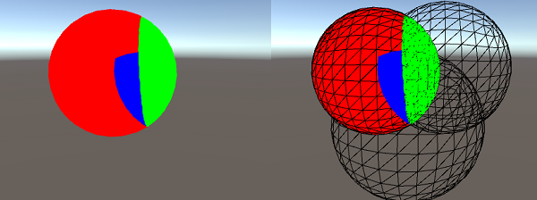
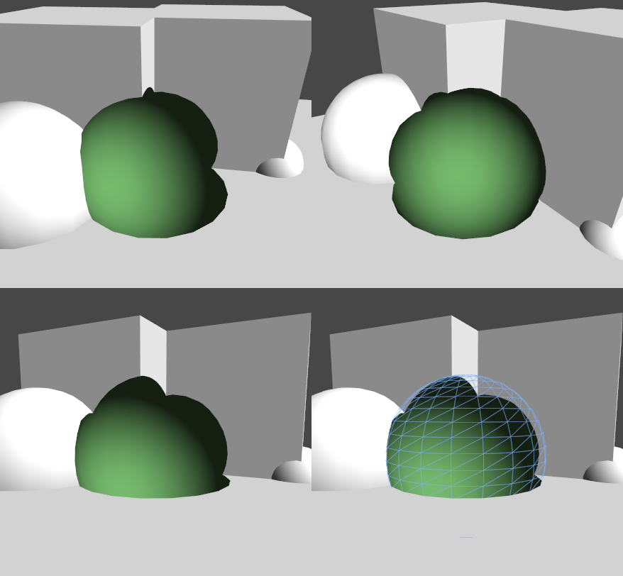

# ShaderLab: Stencil

[TOC]

可以使用stencil buffer作为通用像素掩码来保存或丢弃像素。

Stencil buffer通常为8 bit整数每像素。该值可以被写为递增或递减。后续的调用，可以测试该值，来决定运行pixel shader前，是否应该将像素丢弃

## Syntax

### Ref

```c
  Ref referenceValue
```

该值用来比较（当 *Comp* 设置为非*always*）并／或 用来写入到buffer（如果任何Pass，Fail，ZFail被设置来代替他）。为 0–255 整数.

### WriteMask

```c
   WriteMask writeMask
```

一个8 bit的mask，值为0-255的整数，当写入buffer时使用。注意，和其他写掩码一样，它指定的模版缓冲（stencil buffer）会被写操作影响。（例如：WriteMask 0 意味着没有bit会受影响，而不是0值会被写入）。 默认值为: 255.

### Comp

```c
    Comp comparisonFunction
```

该函数用来比较reference值和当前buffer中的内容。默认为: *always*.

比较公式：(Ref & ReadMask) Comp (CurrentTargetContextValue & ReadMask) ? Pass : Fail

### Pass

```c
    Pass stencilOperation
```

表示要做什么，当buffer内容通过了测试（以及深度测试）。 默认: *keep*.

### Fail

```c
    Fail stencilOperation
```

表示要做什么，当buffer的内容没有通过测试。 默认: *keep*.

### ZFail

```c
    ZFail stencilOperation
```

如果模板测试失败，该如何处理缓冲区的内容。 默认: *keep*.

Comp, Pass, Fail 和 ZFail 将被提供给前置面(front-facing)几何对象，除非 *Cull* Front被指定，在这种情况下是提供给后置面(back-facing)几何对象。你也可以明确的指出前后两面的stencil状态，定义为 CompFront, PassFront, FailFront, ZFailFront (for front-facing geometry), 和 CompBack, PassBack, FailBack, ZFailBack (for back-facing geometry).

### Comparison Function

比较函数表格:

| 函数     | 描述                                        |
| -------- | ------------------------------------------- |
| Greater  | 只渲染reference值比buffer中值大的像素       |
| GEqual   | 只渲染reference值比buffer中值大或等于的像素 |
| Less     | 只渲染reference值比buffer中值小的像素       |
| LEqual   | 只渲染reference值比buffer中值小或等于的像素 |
| Equal    | 只渲染reference值比buffer中值等于的像素     |
| NotEqual | 只渲染reference值比buffer中值不等于的像素   |
| Always   | 让stencil测试总是通过                       |
| Never    | 让stencil测试总是失败                       |

### Stencil Operation

Stencil 操作表格:

| 操作     | 描述                                       |
| -------- | ------------------------------------------ |
| Keep     | 保留当前buffer内容                         |
| Zero     | 写入0到当前buffer                          |
| Replace  | 写入reference值到当前buffer                |
| IncrSat  | 当前buffer的值+1。如果已经达到255则保持255 |
| DecrSat  | 当前buffer的值-1。如果已经达到0则保持0     |
| Invert   | 反转所有位                                 |
| IncrWrap | 当前buffer的值+1。如果已经达到255则变为0   |
| DecrWrap | 当前buffer的值-1。如果已经达到0则变为255   |

## Deferred rendering path（延迟渲染路径）

在延迟渲染路径里的对象渲染用的Stencil功能是有一定的限制的，比如在 g-buffer pass或 lighting pass过程中,Unity通常把stencil buffer用于它途。在这两个阶段，在shader中定义的stencil状态会被忽略，因为这样不可能在stencil测试时用掩码输出这些对象，但是stencil还是可以改变buffer内容，这一般会在每帧对象渲染的最后被调用。在forward rendering path中被渲染的对象会随着deferred path（例如：透明对象或是不使用surface shader的对象）来再一次的设置它们的stencil状态为平时的普通状态。

延迟渲染路径，使用三个高位的stencil buffer bits，再加上四个最高位 - 这取决于有多少光照遮罩层在该场景被使用。 它可能实现“clean” bits操作通过stencil的read和wirte mask，或者你可以强制相机清除stencil buffer 在光照pass后使用`Camera.clearStencilAfterLightingPass`.

### Example

第一个例子，将写入值 ‘2’，无论深度测试是否通过。这时模板测试设为alawys pass。

```C#
Shader "Red" {
    SubShader {
        Tags { "RenderType"="Opaque" "Queue"="Geometry"}
        Pass {
            Stencil {
                Ref 2
                Comp always
                Pass replace
            }

            CGPROGRAM
            #pragma vertex vert
            #pragma fragment frag
            struct appdata {
                float4 vertex : POSITION;
            };
            struct v2f {
                float4 pos : SV_POSITION;
            };
            v2f vert(appdata v) {
                v2f o;
                o.pos = UnityObjectToClipPos(v.vertex);
                return o;
            }
            half4 frag(v2f i) : SV_Target {
                return half4(1,0,0,1);
            }
            ENDCG
        }
    } 
}
```

第二个shader将通过只当上一个shader（red）通过时，因为它检查了值是否等于‘2’。如果z测试失败，它也会降低缓冲区中的值。

```c#
Shader "Green" {
    SubShader {
        Tags { "RenderType"="Opaque" "Queue"="Geometry+1"}
        Pass {
            Stencil {
                Ref 2
                Comp equal
                Pass keep 
                ZFail decrWrap
            }

            CGPROGRAM
            #pragma vertex vert
            #pragma fragment frag
            struct appdata {
                float4 vertex : POSITION;
            };
            struct v2f {
                float4 pos : SV_POSITION;
            };
            v2f vert(appdata v) {
                v2f o;
                o.pos = UnityObjectToClipPos(v.vertex);
                return o;
            }
            half4 frag(v2f i) : SV_Target {
                return half4(0,1,0,1);
            }
            ENDCG
        }
    } 
}
```

第三方shader将在模板值为‘1’时通过，所以只有, 所以只有红色和绿色球体相交处的像素 - 因为, 该模版被red shader设置为 ‘2’ 并且被green shader减到‘1’。

```C#
Shader "Blue" {
    SubShader {
        Tags { "RenderType"="Opaque" "Queue"="Geometry+2"}
        Pass {
            Stencil {
                Ref 1
                Comp equal
            }

            CGPROGRAM
            #include "UnityCG.cginc"
            #pragma vertex vert
            #pragma fragment frag
            struct appdata {
                float4 vertex : POSITION;
            };
            struct v2f {
                float4 pos : SV_POSITION;
            };
            v2f vert(appdata v) {
                v2f o;
                o.pos = UnityObjectToClipPos(v.vertex);
                return o;
            }
            half4 frag(v2f i) : SV_Target {
                return half4(0,0,1,1);
            }
            ENDCG
        }
    }
}
```

结果如下图：



另一个更直接效果的例子。 首先用这个着色器渲染球体，以标记模板缓冲区中的适当区域:

```C#
Shader "HolePrepare" {
    SubShader {
        Tags { "RenderType"="Opaque" "Queue"="Geometry+1"}
        ColorMask 0
        ZWrite off
        Stencil {
            Ref 1
            Comp always
            Pass replace
        }

        CGINCLUDE
            struct appdata {
                float4 vertex : POSITION;
            };
            struct v2f {
                float4 pos : SV_POSITION;
            };
            v2f vert(appdata v) {
                v2f o;
                o.pos = UnityObjectToClipPos(v.vertex);
                return o;
            }
            half4 frag(v2f i) : SV_Target {
                return half4(1,1,0,1);
            }
        ENDCG

        Pass {
            Cull Front
            ZTest Less

            CGPROGRAM
            #pragma vertex vert
            #pragma fragment frag
            ENDCG
        }
        Pass {
            Cull Back
            ZTest Greater

            CGPROGRAM
            #pragma vertex vert
            #pragma fragment frag
            ENDCG
        }
    } 
}
```

然后再作为一个完全的标准表面着色器渲染一次, 除了正面的剔除, 停用深度测试和模版测试，丢弃之前标记的像素:

```C#
Shader "Hole" {
    Properties {
        _Color ("Main Color", Color) = (1,1,1,0)
    }
    SubShader {
        Tags { "RenderType"="Opaque" "Queue"="Geometry+2"}

        ColorMask RGB
        Cull Front
        ZTest Always
        Stencil {
            Ref 1
            Comp notequal 
        }

        CGPROGRAM
        #pragma surface surf Lambert
        float4 _Color;
        struct Input {
            float4 color : COLOR;
        };
        void surf (Input IN, inout SurfaceOutput o) {
            o.Albedo = _Color.rgb;
            o.Normal = half3(0,0,-1);
            o.Alpha = 1;
        }
        ENDCG
    } 
}
```

获得结果如下图：

