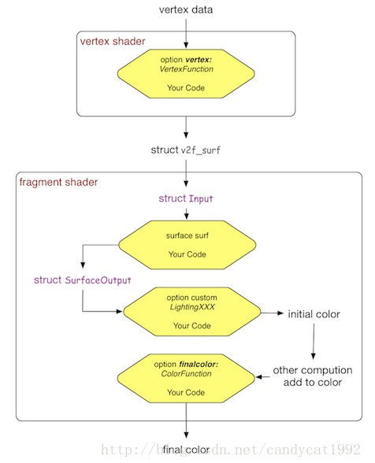

# Unity ShaderLab Usage Manual

[TOC]

## ShaderVariables

[.../Manual/SL-UnityShaderVariables.html](./SL-UnityShaderVariables.md) （已翻译）

## BuiltinMacros

[.../Manaul/SL-BuiltinMacros.html](./SL-BuiltinMacros.md)（已翻译）

## BuiltinFunctions

[.../Manual/SL-BuiltinFunctions.html](./SL-BuiltinFunctions.md)（已翻译）

## Surface Shader的写法

**参考**:<u>.../Manual/SL-SurfaceShaders.html</u>

> 使用类似NVIDIA Cg2.2的语法


###  指定指令

**SubShader**段里指定:

```c#
#pragma surface surfaceFunction
		LightFunction
		[vertex:vertexFunction]
		[finalColor:ColorFunction]
		[optionalParam1]
        [optionalParam2]
        ...
```


> 说明：
>
> １.surface surfaceFunction这一块，surfaceFunction就是你要实现的处理函数
>
> ２.LightFunction是光照处理函数，其用法是紧跟在1.后面，用来指出光照函数用的是哪一个，如果没有指定，系统就会采用默认光照函数，而如果当你制定自己的函数时，命名规则是LightingLightFunction，这里前面的”Lighting”必须加在你的函数名称前。



从上图可以看出来，`Surface Shader`背后的”那些女人“就是`vertex shader`和`fragment shader`。除了`VertexFunction`外，另外两个结构体和三个函数都是在`fragment shader`中扮演了一些角色。`Surface Shader`首先根据我们的代码生成了很多Pass，用于forwardbase和forwardadd等，这不在本篇的讨论范围。而每个Pass的代码是基于上述四个函数生成的。

以一个Pass的代码为例，`Surface Shader`的生成过程简述如下：
直接将CGPROGRAM和ENDCG之间的代码复制过来（其实还是更改了一些编译指令），这些代码包括了我们对`Input`、`surfaceFuntion`、`LightingXXX`等变量和函数的定义。这些函数和变量会在之后的处理过程中当成普通的结构体和函数进行调用，就和在C++中我们会在main函数中调用某些函数一样；

分析上述代码，生成`v2f_surf`结构，用于在`Vertex Shader`和`Fragment Shader`之间进行数据传递。Unity会分析我们在四个自定义函数中所使用的变量，例如纹理坐标等。如果需要，它会在`v2f_surf`中生成相应的变量。而且，即便有时我们在Input中定义了某些变量（如某些纹理坐标），但Unity在分析后续代码时发现我们并没有使用这些变量，那么这些变量实际上是不会在`v2f_surf`中生成的。这也就是说，Unity做了一些优化动作。

生成`Vertex Shader`。

* 如果我们自定义了`VertexFunction`，Unity会在这里首先调用`VertexFunction`修改顶点数据；然后分析`VertexFunction`修改的数据，最后通过`Input`结构体将修改结果存储到`v2f_surf`中。
* 计算`v2f_surf`中其他默认的变量值。这主要包括了`pos`、`纹理坐标`、`normal`（如果没有使用LightMap）、`vlight`（如果没有使用LightMap）、`lmap`（如果使用LightMap）等。
* 最后，通过内置的`TRANSFER_VERTEX_TO_FRAGMENT`指令将`v2f_surf`传递给下面的`Fragment Shader`。

生成`Fragment Shader`。

* 使用`v2f_surf`中的对应变量填充`Input`结构，例如一些纹理坐标等。
* 调用`surfFuntion`填充`SurfaceOutput`结构。
* 调用`LightingXXX`函数得到初始的颜色值。
* 进行其他的颜色叠加。如果没有启用LightMap，这里会使用`SurfaceOutput.Albedo`和`v2f_surf.vlight`的乘积和原颜色值进行叠加；否则会进行一些更复杂的颜色叠加。
* 最后，如果自定了final函数，则调用它进行最后额颜色修改。


### surfaceFunction的函数原型必须如下

```C
void surf...name(Input IN, inout SurfaceOutput o);
```

#### Input定义如下:

```c
struct Input {
    float2 uv_MainTex;	// 必须有一个uv层的通道，需"uv"开关
    float2 uv_HeightTex;	// 可选的第二个uv层，须"uv_..."写法

    //...
};

```

#### 在不同的上下文中，这个标准定义的Input有如下可以使用的附加成员:

```C#
float3 viewDir;
float4 ____: COLOR;
float4 screenPos;
float3 worldPos;
float3 worldRef1;
float3 worldNormal;
float3 worldRef1;		// INTERNAL_DATA，使用WorldReflectionVector(IN, o.Normal)
INTERNAL_DATA			// eg: Builtin shader, Refect-Bumped.Shader

float3 worldNormal;		// INTERNAL_DATA，使用WorldNormalVector(IN, o.Normal)
INTERNAL_DATA
```

#### SurfaceOutput，SurfaceOutputStandard, SurfaceOutputStandardSpecular的对比

| SurfaceOutput       | SurfaceOutputStandard (PBR) | SurfaceOutputStandardSpecular (PBR) | description                                        |
| ------------------- | --------------------------- | ----------------------------------- | -------------------------------------------------- |
| fixed3 Albedo       | fixed3 Albedo               | fixed3 Albedo                       |                                                    |
| half Specular       |                             | **fixed3** Specular                 | float spec = pow (nh, s.Specular*128.0) * s.Gloss; |
| fixed3 Normal       | fixed3 Normal               | fixed3 Normal                       |                                                    |
| **fixed3** Emission | half3 Emission              | half3 Emission                      |                                                    |
|                     | half Metalic                |                                     | non-[0,1]-metal                                    |
|                     | half Smoothness             | half Smoothness                     | rougth-[0,1]-smooth                                |
|                     | half Occlusion              | half Occlusion                      | 1 = default                                        |
| fixed Gloss         |                             |                                     |                                                    |
| fixed Alpha         | fixed Alpha                 | fixed Alpha                         | c.a = o.Alpha;                                     |


#### lightModel的说明

| lightModel的选项     | 对应shader中的数据结构体类型说明                  |
| -------------------- | ------------------------------------------------- |
| Standard             | SurfaceOutputStandard, Physical Based             |
| StandardSpecular     | SurfaceOutputStandardSpecular, Physical Based     |
| Lambert(diffuse)     | (from Unity4.x), Non-Physical Based               |
| BlinnPhong(specular) | (from Unity4.x), Non-Physical Based               |
| custom LM...         | **DIY**: .../Manual/SL-SurfaceShaderLighting.html |


#### 可选参数

##### 关于透明和alpha testing

`alpha`[:auto] <- 默认

​          [:blend]

​          [:fade]

​          [:premul]

`alphatest`: VariableName		VariableName是个float

`keepalpha`					写1.0到alpha通道上

`decal`[:add]

​         [:blend]


##### 修改器function

`vertex`: VertexFunction

`finalgbuffer`: ColorFunction

`finalcolor`: ColorFunction

`finalprepass`: ColorFunction

##### Shadows

`addshadow`				用于定制VertexFunction时使用

`fullforwardshadows`		所有类型的光作为shadows, 在forward渲染路径上使用

##### Tesselation

`tesselate`: TessFunction	用dx11 GPU tesselation特性

##### 代码生成选项

`exclude_path`: deferred

   ​                        :  forward

   ​                        :  prepass

`noshadow`, `no ambient` (说明：禁用所有**ambient lighting**和**light probe**), `novertexlights`, `nolightmap`

`nodynlightmap`			禁用运行时动态全局照明

`nodirlightmap`, `nofog`,  `nometa` (说明：禁用**"meta" pass**)

`noforwardadd`			禁用forward rendering的additive pass，只剩一个方向光和顶点光

`nolppv`					禁用"Light Probe Proxy Volume"

`noshadowmask`

##### 其它杂项

`softvegetation`

`interpolateview`

`halfasview`

`dualforward`

`dithercrossfade`


### ShaderLab定义中的Properties

**参考**:  官方链接中的 <u>.../Manual/SL-Properties.html</u>

**书写格式**

```C#
Properties {
    name ("display name", <Type>) = init value
}
```

这里`name`由你自己命名

这里`display name`是个字符字面量

`<Type>`可以如下:

| 类型写法        | 初始值(init value)   | 格式      | 对应Cg类型                  |
| --------------- | -------------------- | --------- | --------------------------- |
| Range(min, max) |                      |           | float, half, fixed          |
| Float           |                      |           | float, half, fixed          |
| Int             |                      |           | float, half, fixed          |
| Color           |                      | (r,g,b,a) | float4,half4,fixed4         |
| Vector          |                      | (x,y,z.w) | float4,half4,fixed4         |
| 2D              | "default texture" {} |           | sampler2D[_half\|__float]   |
| Cube            | "" {}                |           | samplerCUBE[_half\|__float] |
| 3D              | "" {}                |           | sampler3D[_half\|__float]   |
| 2D Array        | "" {}                |           |                             |
| ...             |                      |           |                             |

> 上面表格里出现的`r`,`g`,`b`,`a`,`x`,`y`,`z`,`w`都是`浮点数字面标量`，比如写成: `(0.5,0.5,0.5,1.0)`
>
> `＂default texture＂｛｝`可以写成内置的常量，同样也用于`Cube`,`3D`,`2D Array`如下：
>
> `white`
>
> `black`
>
> `grey`		这个相当于用`(0.5,0.5,0.5,0.5)`初始化
>
> `bump`		这个相当于用`(0.5,0.5,1.0,0.5)`初始化
>
> `red`			这个相当于用`(1.0,0,0,0)`初始化
>
> ...
>

在一个`property`的`name`前面可以加**PropFlags**，如:  `[HideInspector]`, `[NoScaleOffset]`, `[MaterialToggle]`  ...

### ShaderLab中的有关Cg&HLSL的变体语法

#### 原始数据类型

**参考**: <u>.../Manual/SL-DataTypesAndPrecision.html</u>

| 类型     | 位      | 范围                        | 用法           |
| -------- | ------- | --------------------------- | -------------- |
| bool     | NA      | true/false                  |                |
| int/uint | NA      |                             |                |
| half     | 16bit   | (-65537,+65535)，精度到0.01 | 用于uv         |
| float    | 24bit   |                             |                |
| double   | 32bit   |                             | (ps4_0, d3d11) |
| fixed    | 8~11bit | [-2.0, +2.0] 或 1/256       |                |

#### 复合语法

> **type1...4**

这个时候的分量访问可以用`.xyzw`或`.rgba`，或`.xyxy`或`.gga`，但这两种不能混合

这个时候一个`float`好比写了`float1x1`，这两种写法等价

`type1x4`好比`type4`，由此可以推断可以写`type4x4`，这个时候可以使用下表语法代替分量语法,

eg:

```C#
float4 preMul = {1,1,1,1};
float c = preMul[2];

```

#### 数组语法

> type name[Dim]

**type**:`原始数据类型`或`复合语法类型`

**name**:数组名称

**Dim**:维度长度

#### 函数上的"输入修饰符(Input Modifier)"

**参考**: DirectX Graphics Doc -- Function Arguments(HLSL)

| 修饰符  | 说明                                                  |
| ------- | ----------------------------------------------------- |
| in      |                                                       |
| out     |                                                       |
| inout   |                                                       |
| uniform | 用于cg/hlsl -- 可以写在全局，也可以写在函数定义参数上 |

eg:

```C#
void function(in int v, out float f);
```

#### 字符串类型

`string`

> eg: string str = "...";
>

#### 存储修饰符

`const`

`static`

`extern`

#### 多维度语法

`vector<T, dimN>`				eg: vector<float, 4> 等价　float4

`matrix<T, dimN, dimM>`		eg: matrix<fixed, 3, 3>　等价 fixed3x3


### ShaderLab中的Semantics语法

**参考**：<u>.../Manual/SL-VectexProgramInput.html</u>

​           <u>.../Manual/SL-VectexSemantics.html</u> -> link to MSDN

#### 顶点着色器

> 提供Vertex Data给Vertex程序的Unity内置类型结构定义成分:
>

**appdata_base** <= position + normal + coordinate

**appdata_tan**   <= position + `tangent` + normal + coordinate

**appdata_full**   <= position + tangent + normal + coordinate + `coordinate X 3` + `color`

**appdata_img**  <= ...

#### 片段着色器

```c#
// 写法1. 用原始数据类型作为输出
fixed4 frag(v2f i): SV_Target {
    //...
}

// 写法2. 用结构体定义输出
struct fragOutput {
    fixed4 color: SV_Target;
};
fragOutput frag(v2f i) {
    // ...
}
```

片段着色器的输出语义(SV_Target)还可以用SV_Target1...N，SV_Target0与SV_Target等价．

#### 常用语义列表

| 语义标识符               | 类型                 | 说明                                              |
| ------------------------ | -------------------- | ------------------------------------------------- |
| POSITION                 | float3, float4       |                                                   |
| SV_Depth                 |                      |                                                   |
| NORMAL                   | float3               |                                                   |
| TANGENT                  | float4               |                                                   |
| SV_POSITION              |                      |                                                   |
| TEXCOORD0, TEXCOORD1...N | float2,float3,float4 | 一般情况下__.w默认为1,float4时一般默认为(x,y,0,1) |
| COLOR0, COLOR1...N       | float4               |                                                   |
| VPOS                     |                      |                                                   |
| VFACE                    |                      |                                                   |
| UNITY_VPOS_TYPE          |                      |                                                   |
| SV_VertexID              |                      |                                                   |

### SubShader中的Tags

 **参考**: 　官方链接中的 .../Manual/SL-SubShaderTags.html 

### SubShader的LOD
 **参考**: 　官方链接中的 .../Manual/SL-SubShaderTags.html

#### 语法

> SubShader {  \[Tags\] \[CommonState\] Passdef \[Passdef ...\]  }
>

###### Tags { "Tag1"="val1" "Tag2"="Val2" ... }

`"Tag1"`="Val1"，"TagN"="ValN"可以写成如下：

`"Queue"` = "Background","Geometry","Opaque","AlphaTest","Transparent","Overlay"

`"RenderType"` = ...

`"DisableBatching"` = "True" / "False"

`"ForceNoShadowCasting"` = "True" / "False"

`"IgnoreProjector"` = "True" / "False"

`"CanUseSpriteAtlas"` = "True" / `"False"`

`"PreviewType"` = "Plane" / "Skybox"

###### 写在Pass中的Tags:

**参考**:<u> .../Manual/SL-PassTags.html</u>

相比于**Pass**外部的**Tags**，可以增加下面的:

`"LightMode"` = "Always"

​			"ForwardBase"

​			"ForwardAdd"

​			"Deferred"

​			"ShadowCaster"

​			"MotionVectors"

​			"PrepassBase"

​			"PrepassFinal"

​			"Vertex"

​			'VertexLMRGBM"

​			"VertexLM"

`"PassFlags"` = "OnlyDirectional" / ...

`"RequireOptions"` = "SoftVegetation" / ...


### UsePass用法

有一个**Pass**写成如下:

```c
Shader "Vt/Surf/Steel"
	//...
    Pass {
        Name "MyPassName"
        //...
    }
	//...
}
```

那就在需要使用的地方写**UsePass**为：

```c
SubShader {
    //...
    UsePass "Vt/Surf/Steel/MyPassName"
}
```

### GrabPass用法

```c
SubShader {
    //...
    GrabPass { "GrabNameTex" }
    Pass {
        //...
        sampler2D GrabNameTex;
        //...
    }
}
```

### Fallback用法

```c
SubShader {
    //...
    Fallback ".../PassName"		// 一个pass
}
```

### Shader中的Category

**参考**: 官方链接中的<u>../Manual/SL-Other.html</u>

```c#
Shader "example" {
    Category {
        // Begin--定义的公共部分　　　----
        Fog { Mode off }              |-----
        Blend One One                 |    ｜
        // End--定义的公共部分       ----     |
                                           |
        SubShader {                        |
            // 定义的公共部分应用到了这里 <----|
        }                                  |
                                           |
        SubShader {                        |
            // 定义的公共部分应用到了这里 <----|
        }
    }
}
```


### Pass里的Render State设置
可以看	 [../Manual/SL-Pass.html](./SL-Pass.md) （已翻译）
  > Cull, ZTest	更多的细节看 [.../Manual/SL-CullAndDepth.html](./SL-CullAndDepth.md)（已翻译）
  >
  > Blend			更多的细节看 [.../Manual/SL-Blend.html](./SL-Blend.md)（已翻译）
  >
  > ColorMask
  >
  > Stencil			更多的细节看 [../Manual/SL-Stencil.html](./SL-Stencil.md)（已翻译）

